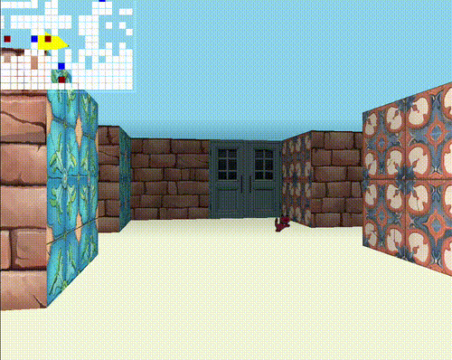

# cub3D - My First Raycaster with MiniLibX

**cub3D** is a 3D graphical representation of the inside of a maze, implemented using ray-casting principles. The program uses the **MiniLibX** library to create the window and handle user inputs for navigating the maze in first-person perspective.

## Project Description

The goal of this project was to create a 3D simulation of a maze with a first-person perspective. Navigation is handled through ray-casting to dynamically render the maze, using the **MiniLibX** library. The application allows the user to move through the maze and look around.

### Implemented Features:
- 3D first-person view of the maze
- Dynamic wall rendering based on ray-casting
- Movement control using the W, A, S, D keys and rotation with the left and right arrow keys
- Different textures for each wall side (North, South, East, West)
- Floor and ceiling color settings
- Use of MiniLibX for graphics and window management

## How to Use

The program expects a **.cub** map file as an argument. You can run the program as follows:
```bash
./cub3D maps/scene_description.cub
```

## Map Format

The **.cub** file should contain:
  - **Textures** for each wall (North, South, East, West)
  - **Colors** for the floor and ceiling
  - **Map layout** using characters that represent walls (1), empty spaces (0), and the player's starting position (N, S, E, W)

## Controls

  - **W, A, S, D**: Move forward, left, backward, right
  - **E**: Feed the cats and open e close doors
  - **Arrow keys**: Rotate left and right
  - **ESC**: Quit the program
  - **Window close button (X)**: Close the window and quit the program

## Bonus Features

This project includes the following bonus features, but they are evaluated only if the mandatory part is PERFECT:

  - Wall collisions
  - Minimap system
  - Doors that can open and close
  - Animated sprites
  - Mouse-controlled point of view

## License

This project is subject to the 42 School's License.


